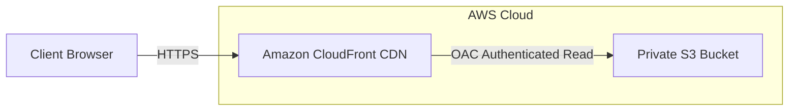

# Deployment Guide: Production AWS Static Web Hosting

This guide outlines the deployment workflow for provisioning the AWS infrastructure and deploying the React Single-Page Application (SPA) to the production environment.

## Architecture Overview



- **S3 Bucket**: Hosts the static production files securely with public access entirely blocked. Enabled with SSE (AES-256) and versioning.
- **CloudFront CDN**: Enforces TLS 1.2+ HTTPS connections, caches assets globally, and redirects 404/403 errors back to `/index.html` for React's client-side router.
- **Origin Access Control (OAC)**: Modern authentication principal allowing CloudFront to fetch objects from S3 without exposing S3 publicly.

---

## Prerequisites

Before beginning, ensure you have the following installed and configured:
1. **AWS CLI** (v2+) installed and configured:
   ```bash
   aws configure
   ```
2. **Terraform** (v1.3+) installed: [Download Terraform](https://developer.hashicorp.com/terraform/downloads)
3. **Node.js** (v18+) and **npm** (v9+).

---

## Step 1: Provision Cloud Infrastructure (`/infra`)

1. Change directory to `/infra`:
   ```bash
   cd infra
   ```
2. Initialize Terraform to download the AWS provider:
   ```bash
   terraform init
   ```
3. (Optional) Run a dry-run check to verify the resources Terraform will create:
   ```bash
   terraform plan
   ```
4. Apply the configuration to provision the bucket and CDN:
   ```bash
   terraform apply -auto-approve
   ```
5. **Note the Outputs** that are printed at the end:
   - `s3_bucket_name`
   - `cloudfront_domain_url`
   - `cloudfront_distribution_id`

---

## Step 2: Build the Frontend Assets (`/frontend`)

1. Change directory to `/frontend`:
   ```bash
   cd ../frontend
   ```
2. Install all development and runtime dependencies:
   ```bash
   npm install
   ```
3. Compile the React TypeScript codebase and build optimization bundles:
   ```bash
   npm run build
   ```
   *This outputs optimized, static assets directly into the `/frontend/dist` directory.*

---

## Step 3: Deploy Assets & Invalidate CDN Cache

Use the outputs from Step 1 (`s3_bucket_name` and `cloudfront_distribution_id`) to upload your files and flush the CDN edge caches.

1. **Upload Assets to S3**:
   Sync the compiled `/dist` directory to S3, removing stale assets in S3:
   ```bash
   aws s3 sync dist/ s3://YOUR_S3_BUCKET_NAME --delete
   ```
2. **Invalidate CloudFront Cache**:
   Notify CloudFront edge locations to immediately fetch the new files from S3:
   ```bash
   aws cloudfront create-invalidation --distribution-id YOUR_CLOUDFRONT_DISTRIBUTION_ID --paths "/*"
   ```

3. **Verify Deployment**:
   Open the `cloudfront_domain_url` (e.g. `https://dxxxxxxxxxx.cloudfront.net`) in your browser to view the live website.
